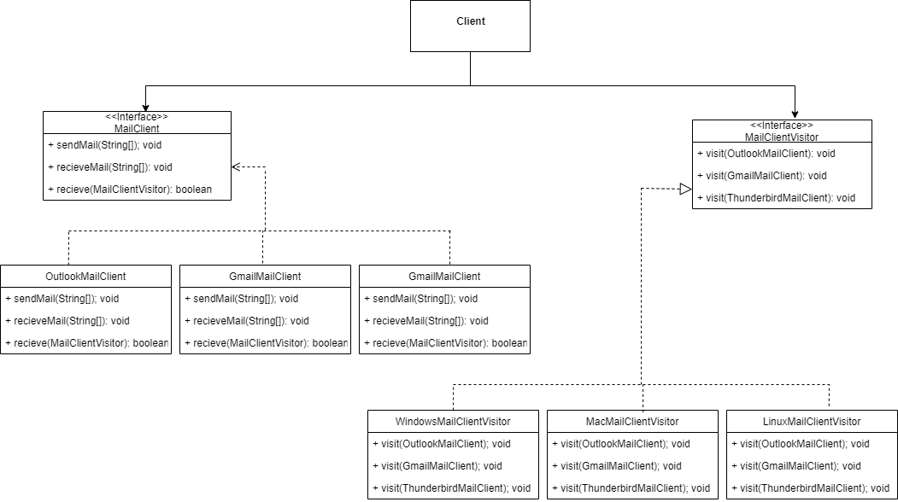

# COMP373_P4_VISITOR

Project 4: Implementing Visitor Pattern

## Inspiration 

For this real-world example of the Visitor pattern, we used a simple implementation of mail client and operating system application. In our implementation, the Visitor is the MailClientVisitor class and the Concrete Vistors are the LinuxMailClientVisitor class, the MacMailClientVistor class, and the WindowsMailClientVisitor class. For the Element, it is the MailClient Class and the Concrete Elements are the GmailMailClient class, the OutlookMailClient class, and the ThunderbirdMailClient class. For this project, there is no Main but you can test the program with the Junit test in the Test package.

## How To Run the Code

Clone the repository to your own development environment and run the Junit test (in Test folder). When run, the tests are successful and the console shows the testing of the mail clients per environment and operation system. Junit 5 has been added to the repo but if the tests are not successful, then you need add it as a dependancy. 

## What Is The Problem Identified In This Project? 

Before implementing the Visitor pattern, the problem that the program would have encounter would have been maintainability. While this program is only showing a few mail clients, in the real-world, this application could easily have hundreds. This would make it extremely difficult to add new operations to the elements without having to modify the program. 

## Solution

With the Visitor pattern, the program examplifies the Open Closed Principal and allows for easier modifications and additions. It makes sure that you can "define a new operation without changing the classes of the elements on which it operates”.

## UML

## Applications Used 

* Draw.IO (ULM Model)
* Eclipse IDE For Java 

## Credit 

Anissa Cristerna,
Henry Espinoza, and
Irfan Poljak
